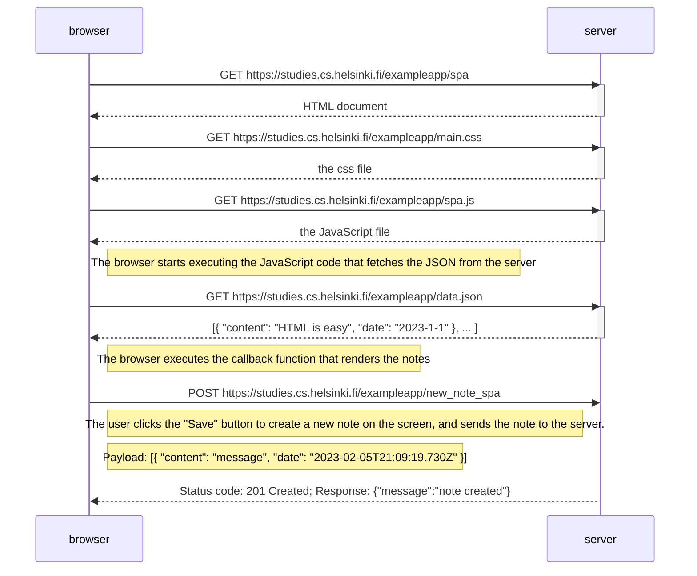

```mermaid
    sequenceDiagram
    participant browser
    participant server

    browser->>server: GET https://studies.cs.helsinki.fi/exampleapp/spa
    activate server
    server-->>browser: HTML document
    deactivate server
    
    browser->>server: GET https://studies.cs.helsinki.fi/exampleapp/main.css
    activate server
    server-->>browser: the css file
    deactivate server
    
    browser->>server: GET https://studies.cs.helsinki.fi/exampleapp/spa.js
    activate server
    server-->>browser: the JavaScript file
    deactivate server
    
    Note right of browser: The browser starts executing the JavaScript code that fetches the JSON from the server
    
    browser->>server: GET https://studies.cs.helsinki.fi/exampleapp/data.json
    activate server
    server-->>browser: [{ "content": "HTML is easy", "date": "2023-1-1" }, ... ]
    deactivate server    

    Note right of browser: The browser executes the callback function that renders the notes

    browser->>server: POST https://studies.cs.helsinki.fi/exampleapp/new_note_spa
    Note right of browser: The user clicks the "Save" button to create a new note on the screen, and sends the note to the server.
    Note right of browser: Payload: [{ "content": "message", "date": "2023-02-05T21:09:19.730Z" }]
    activate server
    server-->>browser: Status code: 201 Created#59; Response: {"message":"note created"}
```